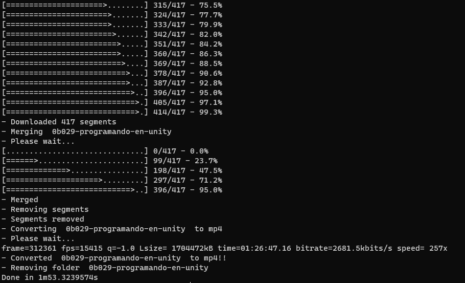

## KVD ~ Kick VOD Downloader

This is a tool to download the VOD from kick.com

---

Requirements:

- FFmpeg (https://ffmpeg.org/download.html)

---

Features:

- Download the VOD from kick.com
- Convert the VOD to mp4
___

_TODO list:_

- [x] Get the m3u8 file from kick
- [x] Parse M3U8 Master Playlist
- [x] Parse M3U8 Video Playlist
- [x] Download the video segments
- [x] Merge the video segments
- [x] Convert the video to mp4
---

## How to use

1. Build the project
2. Run the project with the kick url as the first argument

__Or__

3. Enter the kick url like https://www.kick.com/video/d5843b1c-70d8-426c-bdaf-d69e6d90b80c in the console

---

---

## How to build

> go build -o .
> 

---

## Curiosity

This project was made in 5 hours, so it's not perfect, but it works.